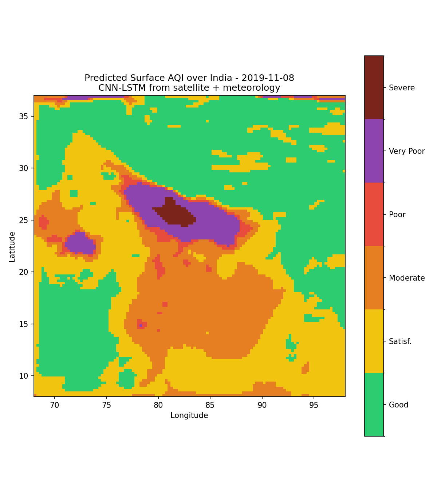
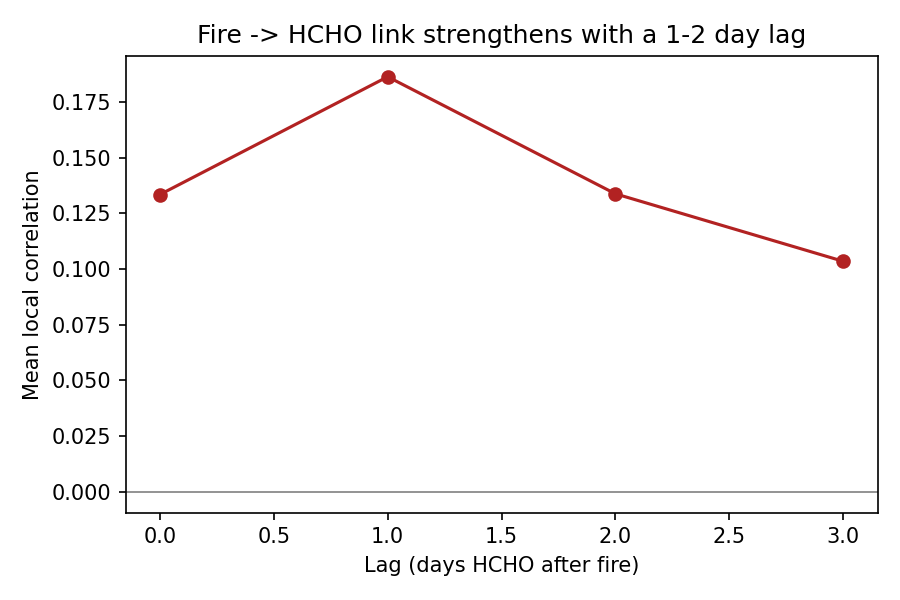
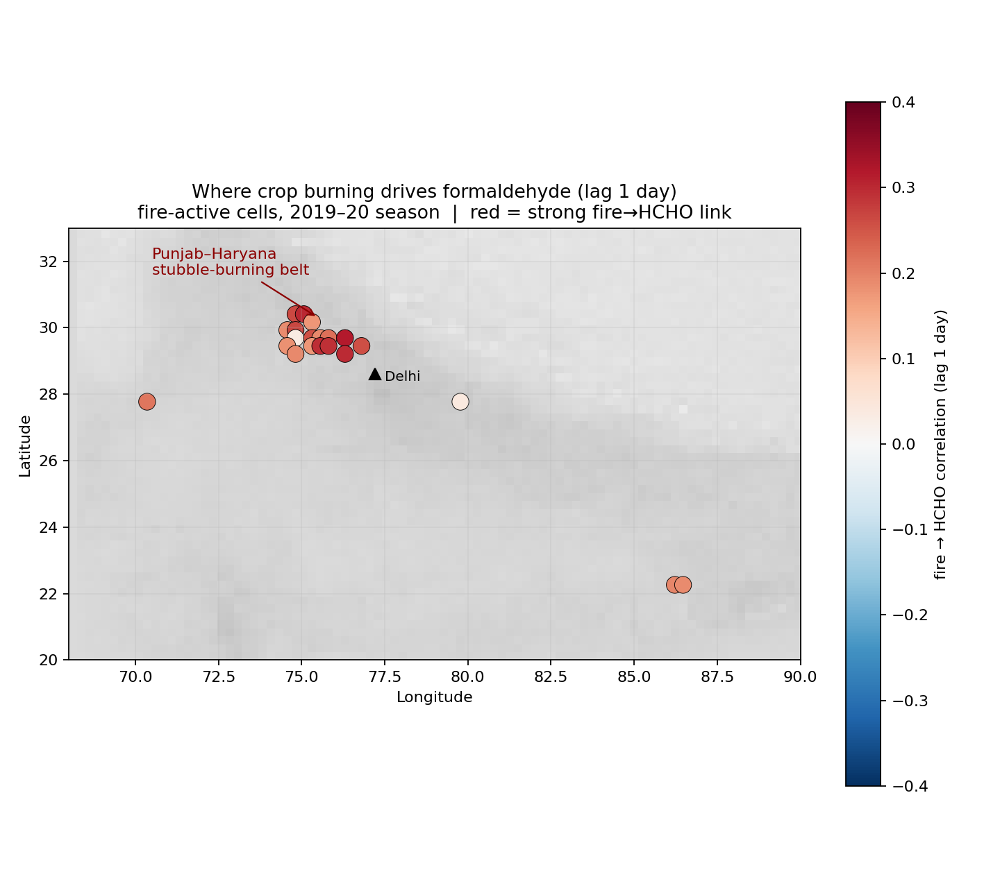
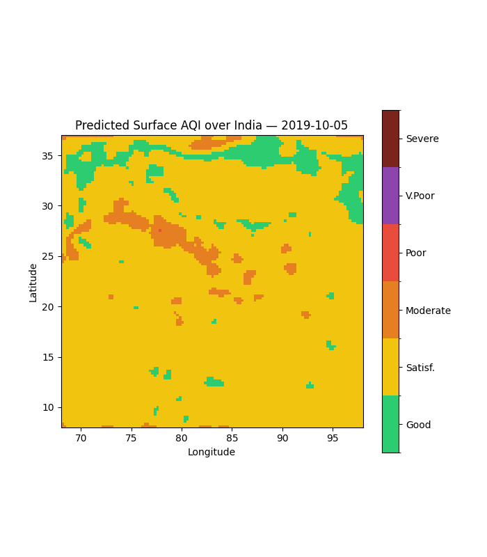

# 🛰️ Surface AQI & HCHO Hotspot Mapping over India using Satellite Data

**ISRO Bharatiya Antariksh Hackathon 2026 — Problem Statement 3**

A deep-learning pipeline that converts daily satellite measurements into
**surface-level Air Quality Index (AQI) maps for all of India** — including the
vast areas with no ground monitors — and detects **formaldehyde (HCHO) hotspots**
linked to crop/forest-fire activity.

🔗 **Live interactive dashboard:** https://isro-bah-aqi.netlify.app/


*Predicted surface AQI (2019-11-08) — pollution concentrated over the Indo-Gangetic Plain.*

---

## The problem
India has ~1.4 billion people but only ~800–1500 CPCB ground air-quality monitors,
almost all in cities. Most of the country has **zero air-quality data**. Satellites
see the whole country daily — but they measure the pollution *column*, not what people
*breathe* at the surface. This project bridges that gap.

## The solution
A **CNN-LSTM** model learns the relationship between satellite columns + meteorology
and CPCB surface measurements, then predicts surface AQI **anywhere** in India.
- **CNN** captures spatial context (a patch of satellite/met bands)
- **LSTM** captures temporal dynamics (a multi-day sequence)
- Output pollutants → **CPCB National AQI** formula → national AQI map
- A second module links **TROPOMI HCHO + MODIS fire + ERA5 wind** to flag burning hotspots

## Results (validated on held-out cities — places the model never saw)
| Pollutant | R² | Note |
|---|---|---|
| **PM2.5** | **0.61** | dominant driver of Indian AQI |
| NO₂ | ~0.04 | genuine skill |
| SO₂ / O₃ | ~ −0.2 | near climatology |
| CO | poor | excluded from AQI composite (known hard problem) |

- AQI maps correctly concentrate pollution over the **Indo-Gangetic Plain**.
- Fire→HCHO link confirmed three ways: **1-day lag peak**, location over **Punjab/Haryana**,
  and **~49% higher HCHO** in fire cells vs no-fire cells.


*The fire→formaldehyde correlation peaks at a 1-day lag — matching real atmospheric chemistry.*


*Where burning drives formaldehyde — concentrated over the Punjab–Haryana stubble-burning belt.*

## Data sources
| Source | Variables | Role |
|---|---|---|
| Sentinel-5P TROPOMI | NO₂, SO₂, CO, O₃, HCHO | model inputs / Obj 2 |
| MODIS MAIAC | AOD | aerosol input (INSAT-3D swap-in planned) |
| MODIS/VIIRS (FIRMS) | active fire | Obj 2 |
| ERA5 | temp, dewpoint, wind, precip | meteorology |
| CPCB (via Kaggle) | surface PM2.5/NO₂/SO₂/CO/O₃ | training labels |

Demonstrated on the **Oct 2019 – Feb 2020** burning season (period with concurrent
TROPOMI + CPCB coverage). Pipeline is year-agnostic.

## Repository structure
```
data_collection/   01 GEE extraction · 02 CPCB labels · 03 ERA5 loader · README
model/             03b training-table builder · 04b CNN-LSTM (masked loss)
output/            05–11 AQI maps, HCHO analysis, time-lapse, dashboard, web app
src/               aqi.py — CPCB National AQI calculator
```

## How to run
1. `data_collection/01_extract_gee.py` — pull satellite + fire + met (Google Earth Engine)
2. `data_collection/02_fetch_ground_kaggle.py` — CPCB labels
3. `model/03b_build_table_masked.py` → `model/04b_train_masked.py` — build + train
4. `output/05b…`, `06/07/08` — maps & HCHO analysis
5. `output/11_build_web_app.py` — generate the interactive web app

## Features
- 🗺️ National surface-AQI maps
- 🔥 HCHO hotspot detection with fire + wind transport
- 🎞️ Seasonal AQI time-lapse animation


*Watch surface AQI build over the Indo-Gangetic Plain as the burning season peaks, then ease.*
- 🌐 Interactive web dashboard (date slider, layer toggles, CPCB health advisories)

## Future work
- Integrate **INSAT-3D AOD** (ISRO's own aerosol product) in place of MODIS AOD
- Extend to multi-year, station-level labels, and AQI nowcasting/forecasting

## Impact for ISRO
A scalable, **monitor-independent** national air-quality tool built entirely on existing
open satellite data — deployable on Bhuvan/MOSDAC at near-zero marginal cost, supporting
**NCAP** targets and **SDG 11.6**.
